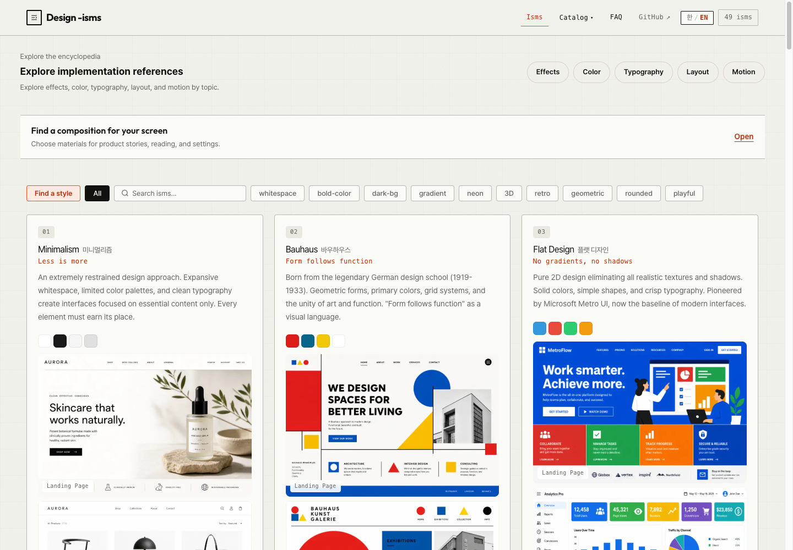
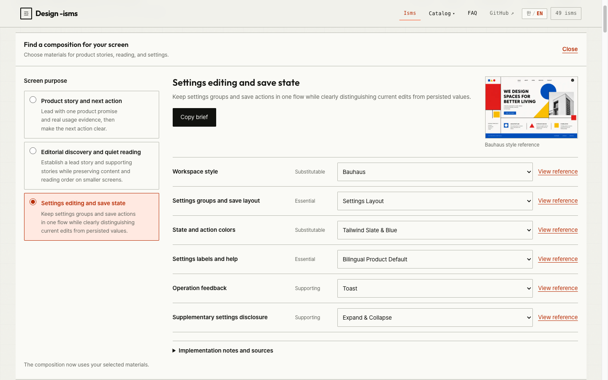

<h1 align="center">Design -isms</h1>
<p align="center"><b>Find a style. Compose a screen. Build with a reference.</b><br>
A visual design atlas, frontend pattern library, and Code Mode MCP for coding agents.</p>

<p align="center"><a href="README.md">English</a> · <a href="README.kr.md">한국어</a></p>

<p align="center">
  <a href="https://lidge-jun.github.io/design-isms/"><b>Explore the atlas →</b></a> ·
  <a href="#install-the-mcp">Install MCP</a> ·
  <a href="#agent-skills">Agent skills</a> ·
  <a href="#code-mode-mcp">API</a> ·
  <a href="https://github.com/lidge-jun/design-isms/issues">Report an issue</a>
</p>

<p align="center">
  <a href="https://github.com/lidge-jun/design-isms/actions/workflows/ci.yml"></a>
  <a href="https://github.com/lidge-jun/design-isms/actions/workflows/deploy.yml"></a>
</p>

## Install the MCP

Requires **Node.js 22+**. Clone the repository; the query runtime uses committed JavaScript and Node built-ins, so no `npm install` or build is needed for MCP use.

```bash
git clone https://github.com/lidge-jun/design-isms.git
```

Add this stdio server to your MCP client. Replace `/absolute/path/design-isms` with the **absolute path** to your clone.
This example uses the `mcpServers` format; your host may use a different configuration file or top-level key.

```json
{
  "mcpServers": {
    "design-isms": {
      "command": "node",
      "args": ["/absolute/path/design-isms/scripts/mcp/server.mjs"]
    }
  }
}
```

Once connected, you should see one tool: **`execute_code`**. Run `return actions.find();` to discover its operations.
[API and examples](#code-mode-mcp) · [Agent skill installation](#agent-skills) · [Use the website](https://lidge-jun.github.io/design-isms/)

<a href="https://lidge-jun.github.io/design-isms/"></a>

Design -isms connects visual references to implementation decisions. Browse styles and interactive UI patterns,
or let your coding agent query the same catalog for palettes, typography, layout guidance, and code examples.

## From reference to implementation

| What you need | What you get |
| --- | --- |
| **A design direction** | Style mockups, history, palettes, and real website references, from Minimalism to Bauhaus and Brutalism |
| **A working pattern** | Bottom sheets, drawers, scroll reveals, and more, with demos, HTML/CSS/JS, and accessibility guidance |
| **A screen composition** | Product landing, editorial reading, and settings recipes with compatible style, color, type, and motion alternatives |
| **An implementation brief** | Usage guidance, constraints, checks, and sources in English or Korean |

### Choose the ingredients. Copy the brief.

Open the recipe chooser on the home page, select a screen purpose, and adjust the permitted alternatives.
Inspect the linked references, then copy the implementation brief into your coding agent. If automatic copying is unavailable,
the full text remains selectable.

<a href="https://lidge-jun.github.io/design-isms/"></a>

Recipes provide design guidance; they do not generate a finished page or certify your product.
The site supports English and Korean. These screenshots show the actual interface; mockups within catalog cards are AI-generated reference images.

## Catalogs

| Catalog | Entries | Includes |
| --- | ---: | --- |
| [Design ISMs](https://lidge-jun.github.io/design-isms/) | 49 | Visual styles and an AI Slop diagnostic, mockups, palettes, and implementation guides |
| [UI Effects](https://lidge-jun.github.io/design-isms/effects.html) | 94 | 46 interface patterns and 48 visual effects, each with a dedicated demo |
| [Color Systems](https://lidge-jun.github.io/design-isms/color.html) | 25 | Semantic palettes, light/dark variants, and contrast guidance |
| [Typography Pairings](https://lidge-jun.github.io/design-isms/typography.html) | 20 | Font pairings, type scales, and live specimens |
| [Layout Patterns](https://lidge-jun.github.io/design-isms/layout.html) | 25 | Responsive wireframes and implementation snippets |
| [Motion Presets](https://lidge-jun.github.io/design-isms/motion.html) | 20 | Easing, duration, playback controls, and reduced-motion alternatives |

Try the Liquid Glass material comparison and interactive motion examples for progress, tabs, and list reordering.
The AI Slop entry is diagnostic only; it is excluded from recommendations and related styles.

## Agent skills

For Claude Code:

```bash
claude plugin marketplace add lidge-jun/design-isms
claude plugin install design-isms@lidge-jun
```

```text
Compare design styles for my portfolio.
Show me bottom-sheet implementation code and accessibility checks.
```

The `style` and `effect` skills read the repository's JSON. They can query a connected Design -isms MCP server when available.
**Plugin installation and MCP configuration are separate steps.**
For Codex and agy installation, skill usage, and troubleshooting, see the [plugin guide (Korean)](docs/PLUGIN.md).

## Code Mode MCP

One public tool, **`execute_code`**, exposes small synchronous functions that return ordinary data.
Its resident description stays below **2,000 UTF-8 bytes**; discover full operation schemas with `actions.find()` and `actions.describe()` as needed.

Pass this as the tool's `code` argument to compose a screen and return its implementation brief:

```js
const composition = design.compose({
  recipeId: 'settings-workspace',
  lang: 'en'
});
return design.brief({ composition }).text;
```

| Operation | Purpose |
| --- | --- |
| `design.search` / `design.get` | Search catalogs and retrieve summaries, guides, or code |
| `design.recipes` / `design.compose` | Discover recipes and compose permitted alternatives |
| `design.brief` | Validate a composition and format it as Markdown |
| `actions.find` / `actions.describe` | Discover operations, arguments, and examples |

Use JavaScript's `map`, `filter`, and `reduce` to work with the returned values.
The default MCP response budget is **8 KiB**, including the JSON-RPC envelope. Code is returned whole or rejected with `RESPONSE_TOO_LARGE`.
Direct search pages can be shortened at item boundaries, with a cursor for the remaining results.

The server uses local stdio and opens no network port. It is intended for trusted local agents:
Worker/VM limits contain mistakes, but are **not a security sandbox for hostile JavaScript**.
See [API details, pagination, and execution limits (Korean)](docs/PLUGIN.md#10-작은-연산을-조합하는-mcp--cli).

## CLI and Unix pipes

From your clone (`cd design-isms`), query the same operations using newline-delimited JSON: one request on stdin, one result on stdout.

```sh
printf '%s\n' '{"op":"design.search","args":{"query":"bottom sheet","limit":3}}' |
  node scripts/design-query.mjs
```

<details>
<summary><b>Compose → brief pipeline (requires jq)</b></summary>

```sh
printf '%s\n' '{"op":"design.compose","args":{"recipeId":"settings-workspace","lang":"en"}}' |
  node scripts/design-query.mjs |
  jq -c '{op:"design.brief",args:{composition:.}}' |
  node scripts/design-query.mjs
```

Errors are also JSON lines. Processing continues after an invalid request; the process exits with code 1 if any request failed.
The CLI does not execute arbitrary JavaScript. Use `node scripts/design-query.mjs --help` to inspect available operations.

</details>

## Development and contributions

Use Node.js 22+ and npm. The local server serves the `.pages/` output created below.

```bash
npm ci
npm run build
npm run verify
npm run pages:stage
npm run serve
```

Open **http://127.0.0.1:4173**. After editing, run `build` → `verify` → `pages:stage` again.
TypeScript lives in `src/`; commit its browser output in `assets/js/`.
The website, skills, and MCP share `assets/data/`. Verification does not generate files.

Submit changes as PRs targeting `dev`. Promoting verified changes to `main` runs verification again and deploys only the
allowlisted `.pages/` output to GitHub Pages. Skills, the MCP server, and development documentation stay outside that deployment.
For bug reports, include the page URL, viewport size, and steps to reproduce.

| Documentation | Contents |
| --- | --- |
| [Project structure](structure/README.md) | Module ownership and sources of truth |
| [Contribution rules (Korean)](AGENTS.md) | Catalog additions, generated JS, imagery, accessibility, and verification contracts |
| [Plugin and MCP guide (Korean)](docs/PLUGIN.md) | Installation, skills, API details, and troubleshooting |
| [FAQ](https://lidge-jun.github.io/design-isms/faq.html) | Choosing and using design references |

<details>
<summary>Catalog maintenance</summary>

Keep PNG originals and WebP previews together. After changing imagery, run `npm run images:thumbs` and the relevant audit procedure,
then `npm run verify` to check hashes, image quality, and preservation of unrelated assets. See the [contribution rules](AGENTS.md).

<!-- data-sot:readme-counts:start -->Catalog source-of-truth counts: 49 ISMs / 94 effects / 18 FAQ answers.<!-- data-sot:readme-counts:end -->

</details>

## Credits and source licenses

| Project | Adapted or referenced ideas | Upstream license |
| --- | --- | --- |
| [StyleGallery](https://github.com/changeroa/StyleGallery) · IYEN | Required, supporting, and substitutable recipe roles; composition constraints | Code: MIT · documentation: CC BY 4.0 |
| [Taste Skill](https://github.com/Leonxlnx/taste-skill) · Leonxlnx | Purpose-led design, density and motion, preserving existing design systems | MIT |
| [aside-codemode](https://github.com/lidge-jun/aside-codemode) · lidge-jun | A single MCP tool with progressive API discovery | MIT |
| [TasteCode](https://github.com/Leonxlnx/tastecode) · Leonxlnx / Blueemi | Browser/Design Mode settling and DOM review practices; research only | Apache-2.0 · no code included |

Pinned revisions, adaptation scopes, and original notices are recorded in [ATTRIBUTION.md](docs/ATTRIBUTION.md).
These licenses apply to their respective upstream materials; they do not establish a blanket license for this repository or its AI-generated images.
