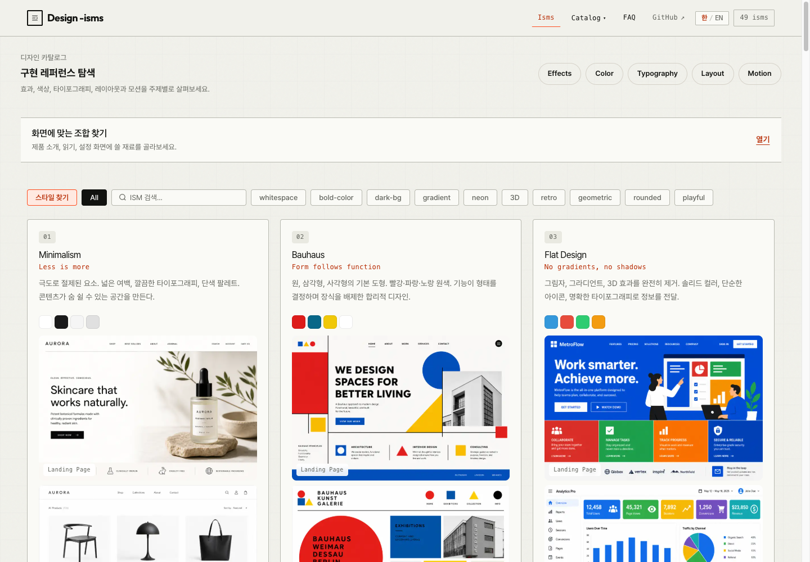
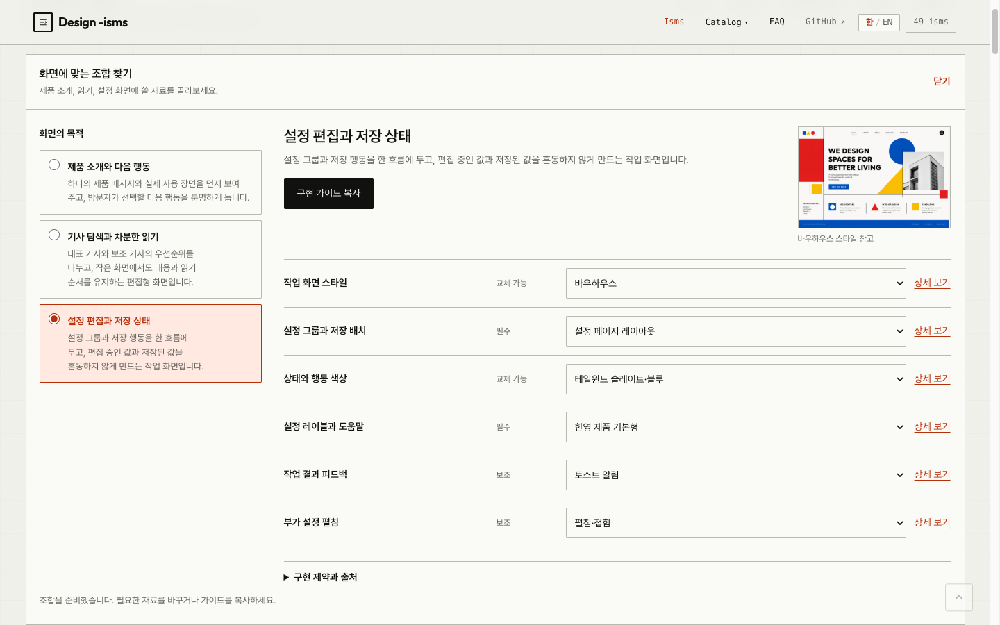

<h1 align="center">Design -isms</h1>
<p align="center"><b>스타일을 보고, 화면을 조합하고, 구현으로 이어가세요.</b><br>
디자인 레퍼런스 아틀라스 · 프런트엔드 패턴 · 에이전트용 Code Mode MCP</p>

<p align="center">
  <a href="https://lidge-jun.github.io/design-isms/"><b>사이트 둘러보기 →</b></a> ·
  <a href="#빠른-시작">빠른 시작</a> ·
  <a href="#code-mode-mcp">MCP</a> ·
  <a href="docs/PLUGIN.md">플러그인 가이드</a> ·
  <a href="https://github.com/lidge-jun/design-isms/issues">문제 제보</a>
</p>

<p align="center">
  <a href="https://github.com/lidge-jun/design-isms/actions/workflows/ci.yml"></a>
  <a href="https://github.com/lidge-jun/design-isms/actions/workflows/deploy.yml"></a>
</p>

<a href="https://lidge-jun.github.io/design-isms/"></a>

**어떤 스타일인지 알아보는 순간부터, 어떻게 만들지 결정하는 순간까지.**
Design -isms는 스타일별 시각 자료와 구현 가이드, 실제 조작할 수 있는 UI 패턴을 모은 레퍼런스입니다.
브라우저에서 살펴보거나, 코딩 에이전트가 같은 데이터를 검색해 팔레트·서체·레이아웃·코드 예시를 가져올 수 있습니다.

## 화면에서 확인하세요

| 필요한 것 | 살펴볼 내용 |
| --- | --- |
| **디자인 방향** | Minimalism, Bauhaus, Brutalism 등 스타일의 이미지·역사·팔레트·실제 사이트 예시 |
| **동작하는 UI** | 바텀시트, 드로어, 스크롤 리빌 등의 데모·HTML/CSS/JS·접근성 및 성능 체크 |
| **화면 구성** | 제품 소개·기사 읽기·설정 작업 레시피와 교체 가능한 스타일·색상·서체·모션 |
| **구현 근거** | 사용하기 좋은 상황, 피해야 할 상황, 구현 제약과 출처를 담은 한영 브리프 |

### 재료를 고르고, 구현 가이드를 복사하세요

메인 페이지의 **화면에 맞는 조합 찾기**에서 목적을 선택하세요. 허용된 대안으로 재료를 바꾸고,
상세 레퍼런스를 확인한 뒤 **구현 가이드 복사**로 에이전트에게 전달할 수 있습니다.
자동 복사가 막히면 전문을 직접 선택해 복사할 수 있습니다.

<a href="https://lidge-jun.github.io/design-isms/"></a>

레시피는 구현을 위한 설계 자료입니다. 완성된 페이지를 생성하거나 사용자 제품의 품질을 자동으로 보증하지는 않습니다.
사이트 화면은 한국어와 영어로 전환할 수 있습니다. 위 이미지는 실제 사이트를 캡처했습니다.

## 카탈로그

| 카탈로그 | 항목 | 포함된 자료 |
| --- | ---: | --- |
| [Design ISMs](https://lidge-jun.github.io/design-isms/) | 49 | 시각 스타일과 AI Slop 진단, 목업 이미지, 팔레트, 개발 가이드 |
| [UI Effects](https://lidge-jun.github.io/design-isms/effects.html) | 94 | 인터페이스 패턴 46종과 시각 효과 48종, 전용 데모와 코드 |
| [Color Systems](https://lidge-jun.github.io/design-isms/color.html) | 25 | 역할별 색상, light/dark 변형, 대비 가이드 |
| [Typography Pairings](https://lidge-jun.github.io/design-isms/typography.html) | 20 | 서체 조합, 타입 스케일, 라이브 스페시먼 |
| [Layout Patterns](https://lidge-jun.github.io/design-isms/layout.html) | 25 | 반응형 와이어프레임과 구현 스니펫 |
| [Motion Presets](https://lidge-jun.github.io/design-isms/motion.html) | 20 | easing·duration, 재생 제어, 모션 감소 대응 |

Liquid Glass의 재질 비교와 Motion의 진행률·탭·목록 재정렬 같은 조작 예제도 확인할 수 있습니다.
카탈로그의 목업·가이드 이미지는 AI 생성 자료이며 실제 서비스의 스크린샷과 구분됩니다.
AI Slop은 진단용 항목으로, 스타일 추천과 관련 항목에는 노출되지 않습니다.

## 빠른 시작

### 웹에서 사용

**[Design -isms 열기](https://lidge-jun.github.io/design-isms/)** — 설치나 계정 없이 탐색할 수 있습니다.
스타일 이름을 모르면 **스타일 찾기**를, 만들 화면의 목적이 정해졌다면 **화면에 맞는 조합 찾기**를 사용하세요.

### 코딩 에이전트에서 사용

Claude Code에는 두 명령으로 설치합니다.

```bash
claude plugin marketplace add lidge-jun/design-isms
claude plugin install design-isms@lidge-jun
```

```text
내 포트폴리오에 맞는 디자인 스타일을 비교해줘.
바텀시트의 구현 코드와 접근성 체크를 보여줘.
```

`style`과 `effect` 스킬이 저장소의 JSON을 읽습니다. 연결된 Design -isms MCP가 있으면 같은 자료를
MCP로 조회할 수 있습니다. **플러그인 설치와 MCP 연결은 별도 설정**입니다.
Codex·agy 설치, 스킬 호출과 문제 해결은 [플러그인 가이드](docs/PLUGIN.md)를 참고하세요.

### 로컬 자료 준비

MCP와 CLI는 Node.js 22 이상이 설치된 환경에서 저장소를 내려받아 실행합니다.
생성된 JavaScript가 포함돼 있어 조회만 할 때는 빌드나 `npm install`이 필요하지 않습니다.

```bash
git clone https://github.com/lidge-jun/design-isms.git
cd design-isms
node scripts/design-query.mjs --help
```

## Code Mode MCP

MCP 클라이언트의 stdio 서버 설정에 다음 내용을 추가합니다. 경로는 내려받은 저장소의 **절대 경로**로 바꾸세요.
호스트마다 설정 파일 위치와 최상위 키가 다르므로 아래는 `mcpServers` 형식의 예입니다.

```json
{
  "mcpServers": {
    "design-isms": {
      "command": "node",
      "args": ["/absolute/path/design-isms/scripts/mcp/server.mjs"]
    }
  }
}
```

공개 도구는 **`execute_code` 하나**입니다. 상주 설명은 2,000 UTF-8바이트 이하로 유지하고,
세부 API는 필요할 때 `actions.find()`와 `actions.describe()`로 조회합니다.

아래 코드를 `execute_code`의 `code` 인수로 전달하면 조합을 구현 브리프로 바꿉니다.

```js
const composition = design.compose({
  recipeId: 'settings-workspace',
  lang: 'ko'
});
return design.brief({ composition }).text;
```

| 연산 | 용도 |
| --- | --- |
| `design.search` / `design.get` | 카탈로그 검색과 상세·가이드·코드 조회 |
| `design.recipes` / `design.compose` | 레시피 탐색과 허용된 대안 조합 |
| `design.brief` | 검증한 조합을 Markdown으로 변환 |
| `actions.find` / `actions.describe` | 연산 목록, 인수와 예시 확인 |

작은 동기 함수가 일반 데이터를 반환하므로 `map`, `filter`, `reduce`로 가공할 수 있습니다.
MCP의 기본 응답 한도는 JSON-RPC 포장을 포함한 8KiB입니다. 코드를 중간에서 자르지 않고,
전체 반환이 불가능하면 `RESPONSE_TOO_LARGE`로 알려줍니다.

로컬 stdio 전용이며 네트워크 포트를 열지 않습니다. 신뢰한 에이전트용으로, Worker/VM을 악성 코드용
보안 샌드박스로 취급하면 안 됩니다. [API·페이지 이동·실행 제한](docs/PLUGIN.md#10-작은-연산을-조합하는-mcp--cli)을 확인하세요.

## CLI와 셸 파이프

같은 연산을 줄 단위 JSON으로 사용할 수 있습니다. stdin 한 줄에 요청 하나, stdout 한 줄에 결과 하나입니다.

```sh
printf '%s\n' '{"op":"design.search","args":{"query":"바텀 시트","limit":3}}' |
  node scripts/design-query.mjs
```

<details>
<summary><b>조합 → 브리프 파이프 예시 (jq 필요)</b></summary>

```sh
printf '%s\n' '{"op":"design.compose","args":{"recipeId":"settings-workspace","lang":"ko"}}' |
  node scripts/design-query.mjs |
  jq -c '{op:"design.brief",args:{composition:.}}' |
  node scripts/design-query.mjs
```

오류도 JSON 한 줄로 반환하며 다음 요청을 계속 처리합니다. 오류가 하나라도 있으면 종료 코드는 1입니다.
CLI는 임의의 JavaScript를 실행하지 않습니다.

</details>

## 개발과 기여

Node.js 22 이상과 npm을 사용합니다. 로컬 서버는 아래 명령에서 만든 `.pages/`를 제공합니다.

```bash
npm ci
npm run build
npm run verify
npm run pages:stage
npm run serve
```

브라우저에서 **http://127.0.0.1:4173**을 여세요. 수정 후에는 `build` → `verify` → `pages:stage`를 다시 실행합니다.
TypeScript는 `src/`, 커밋할 브라우저 산출물은 `assets/js/`, 사이트·스킬·MCP의 공통 데이터는 `assets/data/`에 있습니다.
`verify`는 파일을 생성하지 않습니다.

변경은 `dev` 대상 PR로 제안합니다. 검증한 `dev`를 `main`에 반영하면 GitHub Actions가 다시 검증한 뒤
허용된 `.pages/` 파일만 GitHub Pages에 배포합니다. 스킬·MCP 서버·개발 문서는 사이트 배포에 포함되지 않습니다.
문제 제보에는 페이지 주소, 화면 크기, 재현 순서를 함께 적어주세요.

| 문서 | 내용 |
| --- | --- |
| [프로젝트 구조](structure/README.md) | 모듈별 책임과 데이터의 기준 파일 |
| [기여 규칙](AGENTS.md) | 카탈로그 추가, 생성 JS, 이미지·접근성·검증 계약 |
| [플러그인과 MCP](docs/PLUGIN.md) | 설치, 스킬, API와 문제 해결 |
| [FAQ](https://lidge-jun.github.io/design-isms/faq.html) | 디자인 자료를 고르고 사용하는 방법 |

<details>
<summary>카탈로그 유지보수</summary>

원본 PNG와 WebP 미리보기는 함께 관리합니다. 이미지를 바꾸면 `npm run images:thumbs`와 해당 감사 절차를 실행하고,
`npm run verify`로 해시·이미지 품질·비대상 자료의 보존을 확인하세요. 자세한 절차는 [기여 규칙](AGENTS.md)에 있습니다.

<!-- data-sot:readme-counts:start -->Catalog source-of-truth counts: 49 ISMs / 94 effects / 18 FAQ answers.<!-- data-sot:readme-counts:end -->

</details>

## 출처와 크레딧

| 프로젝트 | 반영한 내용 | 원본 라이선스 |
| --- | --- | --- |
| [StyleGallery](https://github.com/changeroa/StyleGallery) · IYEN | 필수·보조·교체 가능 요소와 화면 조합 제약 | 코드 MIT · 문서 CC BY 4.0 |
| [Taste Skill](https://github.com/Leonxlnx/taste-skill) · Leonxlnx | 목적에 맞는 디자인, 정보 밀도와 모션, 기존 디자인 보존 | MIT |
| [aside-codemode](https://github.com/lidge-jun/aside-codemode) · lidge-jun | 하나의 MCP 도구와 점진적 API 탐색 | MIT |
| [TasteCode](https://github.com/Leonxlnx/tastecode) · Leonxlnx / Blueemi | Browser/Design Mode의 화면 안정화와 DOM 검토 방식 조사 | Apache-2.0 · 코드 미포함 |

확인한 리비전, 각색 범위와 원문 고지는 [ATTRIBUTION.md](docs/ATTRIBUTION.md)에 보존합니다.
위 라이선스는 각 원본 자료에 적용되며, 이 저장소 전체나 AI 생성 이미지의 이용 조건을 대신하지 않습니다.
