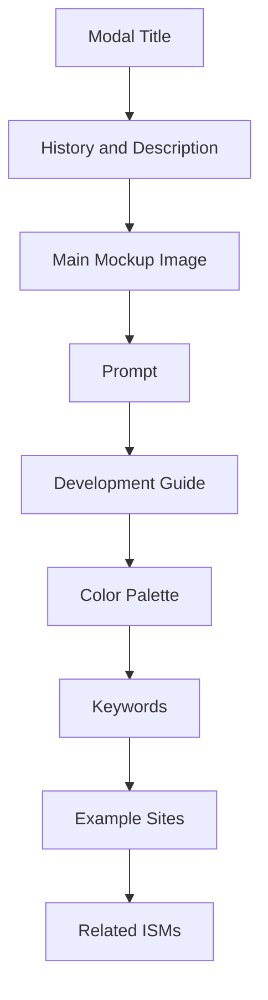
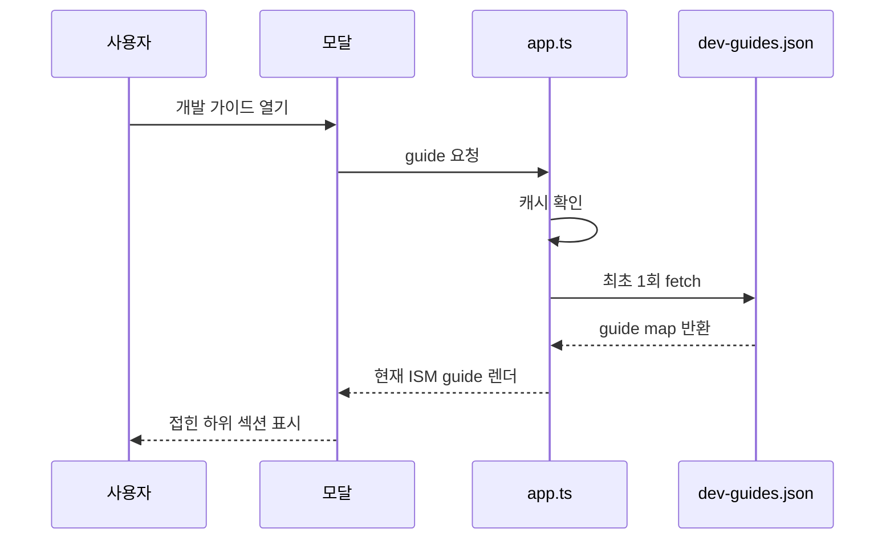

# 팝업 개발 가이드 계획

디자인 ISM 팝업은 지금 시각 레퍼런스와 역사, 프롬프트, 예시 사이트를 보여준다. 다음 단계에서는 여기에 “이 스타일을 실제 제품 UI로 만들 때 어떤 컴포넌트를 어떻게 조립하는가”를 붙인다. 사용자는 예쁜 이미지에서 끝나지 않고, 바로 구현 가능한 구조와 주의점을 팝업 안에서 읽는다.

이 기능은 디자인을 바꾸는 기능이 아니다. 기존 카드, 모달, 색감, 이미지 레이아웃은 그대로 둔다. 모달 내부에 개발자용 정보 레이어를 추가한다. 기본 화면은 지금처럼 가볍게 유지하고, 사용자가 “개발 가이드”를 열 때만 자세한 구조를 보여준다.

중요한 기준은 jawdev식 devlog와 맞는가이다. 산문 감상문이 아니라 구현자가 바로 체크할 수 있는 파일 책임, 컴포넌트 책임, 상태, 접근성, 성능, 검증 항목을 담는다. 각 ISM마다 “어떤 UI 부품이 이 스타일을 만든다”를 반복 가능한 형식으로 정리한다.

사용 흐름은 단순하다. 사용자는 카드에서 ISM을 연다. 팝업 상단에는 기존처럼 이름, 역사, 설명, 이미지가 나온다. 그 아래 또는 프롬프트 근처에 `Development Guide` 접기 섹션이 있다. 섹션을 열면 핵심 컴포넌트, 토큰, 레이아웃 규칙, 구현 체크리스트, 하지 말아야 할 패턴을 확인한다.

---

## 목표

- [ ] 모달 안에서 각 ISM의 개발 가이드를 볼 수 있게 한다.
- [ ] 첫 페이지 로딩에는 개발 가이드 데이터를 싣지 않는다.
- [ ] 스타일별 구현법을 jawdev devlog처럼 구조화한다.
- [ ] CSS/디자인은 변경하지 않고, 기존 모달 컴포넌트 계층에 섹션만 추가한다.
- [ ] `isms.json`의 핵심 큐레이션 데이터와 개발 가이드 데이터를 분리한다.
- [ ] 가이드가 없는 ISM도 모달이 깨지지 않게 한다.

## 현재 신호

| 항목 | 현재 상태 | 해석 |
|---|---|---|
| 런타임 | `src/app.ts` strict TS 원본, `assets/js/app.js` 빌드 산출물 | 타입 있는 확장이 가능하다 |
| 데이터 | `assets/data/isms.json` 35개 ISM | 시각/역사/예시 데이터의 기준 파일이다 |
| 이미지 | 카드/모달은 WebP thumb, lightbox는 PNG 원본 | 모바일 로딩 최적화는 이미 분리되어 있다 |
| 모달 | 문자열 렌더링 기반 | 작은 섹션 추가는 빠르지만 구조가 커지면 helper 분리가 필요하다 |
| devlog | 계획 문서가 `devlog/*.md`에 존재 | feature plan을 남기고 구현하는 흐름과 맞다 |

## 권장 UX

### 섹션 위치

개발 가이드는 메인 이미지와 프롬프트 다음, 컬러 팔레트 전에 둔다. 이유는 “시각 확인 → 생성 프롬프트 확인 → 실제 구현법 확인 → 색/키워드/사이트 참고” 순서가 자연스럽기 때문이다.



### 기본 접힘 상태

- [ ] `Development Guide`는 기본 접힘으로 둔다.
- [ ] 사용자가 열면 같은 모달 안에서 펼친다.
- [ ] 열림 상태는 모달을 닫으면 초기화한다.
- [ ] URL hash에는 반영하지 않는다.
- [ ] 모바일에서는 긴 문서처럼 보이지 않도록 소제목 단위로 다시 접을 수 있게 한다.

### 표시 단위

| 단위 | 예시 | UI 표현 |
|---|---|---|
| 핵심 원칙 | “여백을 기능 단위로 남긴다” | 짧은 문장 3개 |
| 컴포넌트 | Hero, Product Card, Pricing Table | 작은 리스트 또는 미니 카드 |
| 토큰 | spacing, radius, shadow, type scale | 코드 스타일 줄 |
| 상태 | hover, focus, loading, empty | 체크리스트 |
| 금지 패턴 | 과한 그림자, 무관한 gradient | 경고 리스트 |
| 검증 | 모바일, 접근성, 성능 | jawdev 체크리스트 |

## 데이터 설계

### 파일 분리

`isms.json`에 직접 `devGuide`를 넣지 않는다. 개발 가이드는 길어질 가능성이 높고, 첫 화면에서 필요하지 않다. 별도 파일로 분리한다.

```text
assets/data/
├── isms.json
└── dev-guides.json
```

### lazy-load 방식

- [ ] 첫 화면 `init()`에서는 `isms.json`만 가져온다.
- [ ] 사용자가 모달에서 Development Guide를 처음 열 때 `dev-guides.json`을 fetch한다.
- [ ] fetch 결과는 메모리에 캐시한다.
- [ ] 같은 세션에서 다른 모달을 열면 다시 fetch하지 않는다.
- [ ] fetch 실패 시 “개발 가이드를 불러오지 못했어요” 정도의 작은 실패 상태만 보여준다.



### JSON 스키마 초안

```json
{
  "minimalism": {
    "summary": "불필요한 장식을 줄이고 정보 위계를 여백과 타이포그래피로 만든다.",
    "principles": [
      "하나의 화면에는 하나의 주요 행동만 둔다.",
      "경계선보다 간격으로 그룹을 나눈다.",
      "색은 상태와 강조에만 사용한다."
    ],
    "components": [
      {
        "name": "Hero",
        "role": "첫 화면에서 제품 가치와 단일 CTA를 전달한다.",
        "structure": ["eyebrow", "headline", "supporting-copy", "primary-action"],
        "tokens": {
          "spacing": "large vertical rhythm",
          "radius": "0-8px",
          "shadow": "none or very subtle"
        },
        "states": ["focus-visible", "reduced-motion"],
        "avoid": ["decorative blobs", "multiple competing CTAs"]
      }
    ],
    "implementationChecklist": [
      "CTA가 한눈에 보인다.",
      "모바일에서 headline이 3-5줄 안에 들어온다.",
      "이미지 없이도 정보 구조가 유지된다."
    ],
    "accessibility": [
      "색상만으로 상태를 구분하지 않는다.",
      "focus-visible 스타일을 유지한다."
    ],
    "performance": [
      "첫 화면 이미지는 thumbnail 또는 responsive source를 사용한다."
    ]
  }
}
```

### TypeScript 타입 초안

```ts
interface DevGuide {
  summary: string;
  principles: string[];
  components: DevGuideComponent[];
  implementationChecklist: string[];
  accessibility: string[];
  performance: string[];
}

interface DevGuideComponent {
  name: string;
  role: string;
  structure: string[];
  tokens: Partial<Record<'spacing' | 'radius' | 'shadow' | 'type' | 'motion', string>>;
  states: string[];
  avoid: string[];
}

type DevGuideMap = Record<string, DevGuide>;
```

## 렌더링 설계

### 함수 분리

`renderModalContent()`가 이미 크다. 개발 가이드를 직접 붙이면 모달 함수가 다시 비대해진다. 작은 helper를 만든다.

| 함수 | 책임 |
|---|---|
| `renderDevGuideShell(ismId)` | 접힌 개발 가이드 컨테이너 HTML 생성 |
| `setupDevGuideToggle(content, ismId)` | 클릭 시 lazy-load와 렌더 연결 |
| `loadDevGuides()` | `dev-guides.json` fetch와 캐시 |
| `parseDevGuides(raw)` | 최소 런타임 검증 |
| `renderDevGuide(guide)` | guide 상세 HTML 생성 |
| `renderGuideList(title, items)` | checklist/list 공통 렌더 |
| `renderGuideComponent(component)` | 컴포넌트 단위 렌더 |

### 모달 HTML 초안

```html
<div class="modal-collapsible modal-dev-guide" data-guide-ism="minimalism">
  <div class="modal-collapsible-header">
    <span class="modal-collapsible-arrow">▶</span>
    Development Guide
  </div>
  <div class="modal-collapsible-body">
    <div class="modal-collapsible-inner" data-guide-content>
      <div class="modal-guide-placeholder">Open to load guide.</div>
    </div>
  </div>
</div>
```

### 상세 HTML 초안

```html
<div class="modal-guide">
  <p class="modal-guide-summary">...</p>
  <div class="modal-guide-principles">...</div>
  <div class="modal-guide-components">...</div>
  <div class="modal-guide-checklist">...</div>
  <div class="modal-guide-a11y">...</div>
  <div class="modal-guide-performance">...</div>
</div>
```

## 스타일 설계

디자인 자체는 바꾸지 않는다. 새 스타일은 기존 모달의 타이포그래피와 border/radius를 재사용한다.

| 클래스 | 역할 | 주의점 |
|---|---|---|
| `.modal-dev-guide` | 개발 가이드 wrapper | 기존 collapsible 룰을 최대한 재사용 |
| `.modal-guide-summary` | 2-3줄 요약 | hero급 큰 글자 금지 |
| `.modal-guide-principles` | 핵심 원칙 리스트 | 카드 안 카드 금지 |
| `.modal-guide-component` | 컴포넌트 한 단위 | repeated item이므로 작은 card 허용 |
| `.modal-guide-token` | token pill/code | 색 과밀 금지 |
| `.modal-guide-checklist` | 검증 항목 | 체크 아이콘은 CSS text로 충분 |

### CSS 추가 원칙

- [ ] `style.css` 끝에만 추가한다.
- [ ] 기존 클래스 이름을 재정의하지 않는다.
- [ ] 새 CSS는 80줄 이하를 1차 목표로 한다.
- [ ] 모바일에서 nested card처럼 보이면 구조를 줄인다.
- [ ] 텍스트가 긴 항목은 `line-height`와 `overflow-wrap`을 명시한다.

## 콘텐츠 작성 방식

### 1차 범위

처음부터 35개 전부를 완성하려고 하면 품질이 낮아진다. 1차는 대표 5개 ISM으로 형식을 고정한다.

- [ ] Minimalism
- [ ] Brutalism
- [ ] Glassmorphism
- [ ] Bento Grid
- [ ] Neumorphism

### 2차 확장

형식이 검증되면 나머지 30개를 같은 스키마로 채운다.

- [ ] 35개 전체 guide 존재 여부 검사 스크립트 추가
- [ ] guide 없는 ISM fallback 문구 확정
- [ ] `isms.json`의 `keywords`와 guide의 component/tokens가 충돌하지 않는지 검토

### 작성 톤

- [ ] “예쁘다”보다 “어떤 UI 결정이 스타일을 만드는가”를 쓴다.
- [ ] “항상” 같은 절대 표현을 줄인다.
- [ ] 구현자가 바로 확인할 수 있는 명사로 쓴다.
- [ ] 한 항목은 1-2문장으로 제한한다.
- [ ] 장식적 설명보다 체크 가능한 기준을 우선한다.

## 구현 단계

### P1 — dev guide 데이터 계약

- [ ] `assets/data/dev-guides.json` 생성
- [ ] 대표 5개 ISM guide 작성
- [ ] `src/app.ts`에 `DevGuide`, `DevGuideComponent`, `DevGuideMap` 타입 추가
- [ ] `parseDevGuides(raw)` 추가
- [ ] `loadDevGuides()` 캐시 추가

완료 기준:

- [ ] `npm run typecheck` 통과
- [ ] `dev-guides.json` parse 성공
- [ ] guide 없는 id 요청 시 `undefined` 반환

### P2 — 모달 shell 추가

- [ ] `renderModalContent()`에서 palette 전에 `renderDevGuideShell(ism.id)` 삽입
- [ ] guide 섹션은 기본 접힘 유지
- [ ] 모달 열림 직후에는 `dev-guides.json`을 fetch하지 않음

완료 기준:

- [ ] 첫 화면 네트워크 요청이 기존 `isms.json` 중심으로 유지
- [ ] 모달을 열어도 guide 섹션을 클릭하기 전에는 guide fetch 없음

### P3 — lazy-load interaction

- [ ] `setupDevGuideToggle(content, ism.id)` 추가
- [ ] 최초 열기 시 loading 상태 표시
- [ ] fetch 성공 시 guide HTML 삽입
- [ ] fetch 실패 시 error 상태 표시
- [ ] 다시 접고 열면 캐시된 HTML 또는 캐시된 data 사용

완료 기준:

- [ ] 같은 세션에서 guide fetch 1회
- [ ] 네트워크 실패 시 모달 전체가 깨지지 않음

### P4 — guide renderer

- [ ] `renderDevGuide(guide)` 작성
- [ ] `renderGuideComponent(component)` 작성
- [ ] checklist renderer 공통화
- [ ] HTML escaping helper 검토

완료 기준:

- [ ] guide 문자열에 `<`, `&`가 들어가도 UI가 깨지지 않음
- [ ] 빈 배열은 섹션 자체를 숨김
- [ ] 모바일 폭에서 긴 token이 줄바꿈됨

### P5 — 스타일 최소 추가

- [ ] `.modal-guide-*` CSS 추가
- [ ] 기존 modal spacing과 시각 톤 유지
- [ ] 카드 안 카드처럼 보이는 중첩을 피함

완료 기준:

- [ ] desktop modal에서 정보 밀도가 과하지 않음
- [ ] mobile bottom sheet에서 guide가 스크롤 가능
- [ ] 기존 palette/examples/related 섹션 위치와 동작 유지

### P6 — 검증

자동 검증:

- [ ] `npm run typecheck`
- [ ] `npm run build`
- [ ] `node -e "JSON.parse(require('fs').readFileSync('assets/data/dev-guides.json','utf8'))"`
- [ ] guide id와 ism id 매칭 검사 스크립트

브라우저 검증:

- [ ] 첫 화면 카드 렌더링
- [ ] 모달 오픈
- [ ] guide 클릭 전 `dev-guides.json` 요청 없음
- [ ] guide 클릭 후 `dev-guides.json` 1회 요청
- [ ] 대표 5개 guide 정상 표시
- [ ] guide 없는 ISM fallback 표시
- [ ] lightbox 원본 이미지 동작 유지
- [ ] 카드/모달 예시 사이트 3개 표시와 더 보기 유지
- [ ] 콘솔 오류 0개

## 리스크와 대응

| 리스크 | 영향 | 대응 |
|---|---|---|
| 모달 HTML 문자열이 너무 커짐 | 유지보수 저하 | renderer helper로 분리 |
| guide 데이터가 과도하게 길어짐 | 팝업이 문서처럼 무거워짐 | 기본 접힘과 하위 섹션 접힘 |
| `isms.json`과 guide id 불일치 | 일부 guide 미노출 | 검증 스크립트 추가 |
| 모바일에서 텍스트 과밀 | 사용성 저하 | 컴포넌트 단위 접힘과 작은 typography |
| 첫 로딩 증가 | GitHub Pages 성능 저하 | lazy-load 필수 |

## 하지 않는 것

- [ ] 이번 기능에서 CSS 리디자인을 하지 않는다.
- [ ] 기존 프롬프트, 이미지, 예시 사이트 데이터를 수정하지 않는다.
- [ ] 외부 CMS나 Markdown parser를 도입하지 않는다.
- [ ] 모든 35개 guide를 한 번에 완성해야 한다고 가정하지 않는다.
- [ ] 코드 예제를 길게 넣지 않는다. 팝업은 참조 UI이지 문서 사이트가 아니다.

## 최종 산출물

| 파일 | 작업 |
|---|---|
| `assets/data/dev-guides.json` | 신규 guide 데이터 |
| `src/app.ts` | 타입, lazy-load, renderer 추가 |
| `assets/js/app.js` | 빌드 산출물 |
| `assets/css/style.css` | 최소 guide 스타일 |
| `scripts/validate-dev-guides.mjs` | id 매칭과 schema 검증 |
| `devlog/260510_popup_development_guide_plan.md` | 이 계획 문서 |

## 변경 기록

- 2026-05-10: 팝업 안 개발 가이드 기능의 데이터, UX, 렌더링, 검증 계획을 작성했다.
